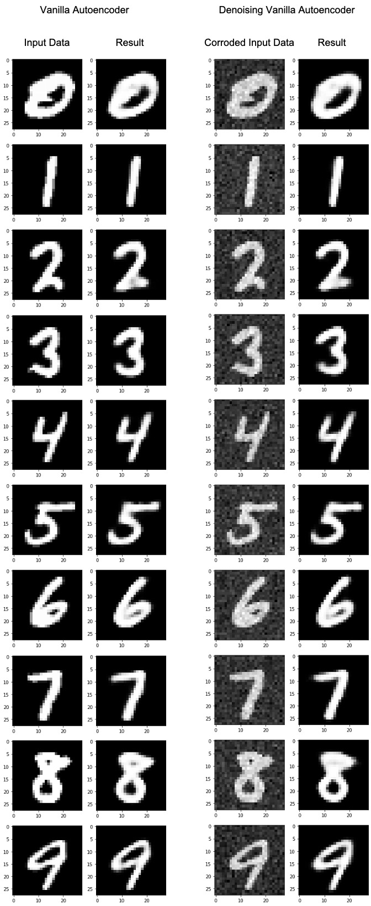

# Autoencoders
한국어 버전의 설명은 [여기](./docs/README_ko.md)를 참고하시기 바랍니다.

## Introduction
An autoencoder is a model used for manifold learning that extracts meaningful latent variables to compress or reduce the dimensionality of the data through the process of compressing and reconstructing the original data. 
In this code, you can find implementations of three types of autoencoders.
For the MNIST dataset, it also provides functionality to visualize the latent variables resulting from the trained model in 2D using t-SNE algorithm.
For an explanation of autoencoders, refer to [Autoencoder (오토인코더)](https://ljm565.github.io/contents/ManifoldLearning1.html), and for information on t-SNE and UMAP, refer to [t-SNE, UMAP](https://ljm565.github.io/contents/ManifoldLearning2.html).
<br><br><br>

## Supported Models
### Vanilla Autoencoder (AE)
* A vanilla autoencoder using `nn.Linear` is implemented.

### Convolutional Autoencoder (CAE)
* A convolutional autoencoder using `nn.Conv2d` and `nn.ConvTranspose2d` is implemented.
When you want to improve model performance, you can use CAE instead of AE.

### Denoising Autoencoder (DAE)
* For the two models introduced above, you can train a denoising autoencoder by adding noise to the data.
Denoising autoencoders can be used to extract more meaningful latent variables from the data.
<br><br><br>

## Base Dataset
* Base dataset for tutorial is [MNIST](http://yann.lecun.com/exdb/mnist/).
* Custom datasets can also be used by setting the path in the `config/config.yaml`.
However, implementing a custom dataloader may require additional coding work in `src/utils/data_utils.py`.
<br><br><br>

## Quick Start
```bash
python3 src/run/train.py --config config/config.yaml --mode train
```
<br><br>

## Project Tree
This repository is structured as follows.
```
├── configs                     <- Folder for storing config files
│   └── *.yaml
│
└── src      
    ├── models
    |   ├── autoencoder.py      <- Valilla autoencoder model file
    |   └── conv_autoencoder.py <- Convolutional autoencoder model file
    |
    ├── run                   
    |   ├── train.py            <- Training execution file
    |   ├── tsne_test.py        <- Trained model t-SNE visualization execuation file
    |   └── validation.py       <- Trained model evaulation execution file
    | 
    ├── tools                   
    |   ├── model_manager.py          
    |   └── training_logger.py  <- Training logger class file
    |
    ├── trainer                 
    |   ├── build.py            <- Codes for initializing dataset, dataloader, etc.
    |   └── trainer.py          <- Class for training, evaluating, and visualizing with t-SNE
    |
    └── uitls                   
        ├── __init__.py         <- File for initializing the logger, versioning, etc.
        ├── data_utils.py       <- File defining the custom dataset dataloader
        ├── filesys_utils.py       
        └── training_utils.py     
```
<br><br>

## Tutorials & Documentations
Please follow the steps below to train the autoencoder.

1. [Getting Started](./docs/1_getting_started.md)
2. [Data Preparation](./docs/2_data_preparation.md)
3. [Training](./docs/3_trainig.md)
4. ETC
   * [Evaluation](./docs/4_model_evaluation.md)
   * [t-SNE Visualization](./docs/5_tsne_visualization.md)

<br><br><br>


## Training Results
* Results of AE and DAE<br><br>
<br><br>
* Latent space visualization via t-SNE<br><br>

<br><br><br>


