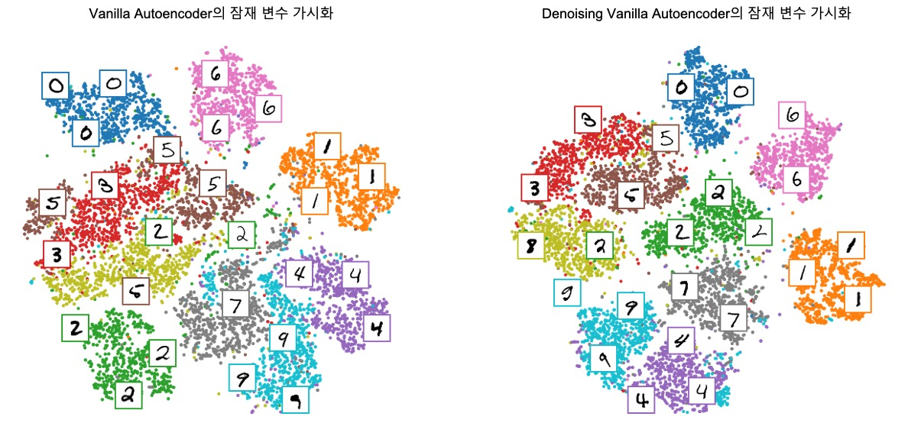

# Autoencoders
## Introduction
Autoencoder (오토인코더)는 원래의 데이터를 압축하고 복구하는 과정에서, 의미있는 잠재 변수를 추출하여 데이터를 압축하거나 차원을 축소하는 manifold learning을 위한 모델입니다.
본 코드에서는 세 종류의 autoencoder 코드를 확인할 수 있으며, MNIST 데이터의 경우 학습 결과로 나온 잠재 변수(latent variable)를 t-SNE를 통해 2차원 데이터로 가시화하는 기능도 제공합니다.
Autoencoder의 설명은 [Autoencoder (오토인코더)](https://ljm565.github.io/contents/ManifoldLearning1.html), t-SNE, UMAP에 대한 글은 [t-SNE, UMAP](https://ljm565.github.io/contents/ManifoldLearning2.html)을 참고하시기 바랍니다.
<br><br><br>

## Supported Models
### Vanilla Autoencoder (AE)
* `nn.Linear`를 사용한 vanilla autoencoder가 구현되어 있습니다.

### Convolutional Autoencoder (CAE)
* `nn.Conv2d` 와 `nn.ConvTranspose2d`를 사용한 convoluational autoencoder가 구현되어 있습니다.
이 모델은 조금 더 복잡한 데이터에 대해 성능을 높이고싶을 때 vanilla autoencoder 대신에 사용할 수 있습니다.

### Denoising Autoencoder (DAE)
데이터에 noise를 주어 denoising autoencoder 모델을 학습할 수 있습니다.
이 기법을 위의 vanilla autoencoder, convolutional autencoder에 모두 적용할 수 있습니다.
Denoising autoencoder는 데이터의 좀 더 의미있는 잠재 변수(latent variable)를 추출하기 위해 사용 가능합니다.
<br><br><br>

## Base Dataset
* 튜토리얼로 사용하는 기본 데이터는 [Yann LeCun, Corinna Cortes의 MNIST](http://yann.lecun.com/exdb/mnist/) 데이터입니다.
* `config/config.yaml`에 학습 데이터의 경로를 설정하여 사용자가 가지고 있는 custom 데이터도 학습 가능합니다.
다만 `src/utils/data_utils.py`에 custom dataloader 코드를 구현해야할 수도 있습니다.
<br><br><br>

## Supported Devices
* CPU, GPU, multi-GPU (DDP), MPS (for Mac and torch>=1.12.0)
<br><br><br>

## Quick Start
```bash
python3 src/run/train.py --config config/config.yaml --mode train
```
<br><br>

## Project Tree
본 레포지토리는 아래와 같은 구조로 구성됩니다.
```
├── configs                     <- Config 파일들을 저장하는 폴더
│   └── *.yaml
│
└── src      
    ├── models
    |   ├── autoencoder.py      <- Valilla autoencoder 모델 파일
    |   └── conv_autoencoder.py <- Convolutional autoencoder 모델 파일
    |
    ├── run                   
    |   ├── train.py            <- 학습 실행 파일
    |   ├── tsne_test.py        <- 학습된 모델 t-SNE 가시화 실행 파일
    |   └── validation.py       <- 학습된 모델 평가 실행 파일
    | 
    ├── tools                   
    |   ├── model_manager.py          
    |   └── training_logger.py  <- Training logger class 파일
    |
    ├── trainer                 
    |   ├── build.py            <- Dataset, dataloader 등을 정의하는 파일
    |   └── trainer.py          <- 학습, 평가, t-SNE 가시화 수행 class 파일
    |
    └── uitls                   
        ├── __init__.py         <- Logger, 버전 등을 초기화 하는 파일
        ├── data_utils.py       <- Custom dataloader 파일
        ├── filesys_utils.py       
        └── training_utils.py     
```
<br><br>

## Tutorials & Documentations
오토인코더 모델 학습을 위해서 다음 과정을 따라주시기 바랍니다.

1. [Getting Started](./1_getting_started_ko.md)
2. [Data Preparation](./2_data_preparation_ko.md)
3. [Training](./3_trainig_ko.md)
4. ETC
   * [Evaluation](./4_model_evaluation_ko.md)
   * [t-SNE Visualization](./5_tsne_visualization_ko.md)
<br><br><br>


## Training Results
* AE, DAE 결과<br><br>
<br><br>
* t-SNE를 통한 AE, DAE 잠재 변수 가시화 결과<br><br>

<br><br><br>


